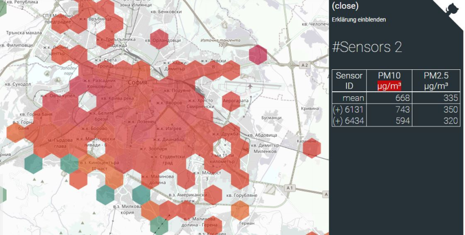

# Executive summary

## Defining the study

### Relevance

- The study would foster the debate on Sofia’s air quality - one of the biggest environmental issues of the city in later years.
- While Sofia Municipality has started to implement prevention policies, in general there is lack of public consensus on the issue, based on facts and rational arguments.
- Taking on the challenge requires multi-domain knowledge and interdisciplinary research approach, while there are many aspects to be studied.
- The current study focuses on one day prediction of air quality by location which would give useful application to the citizens.

Figure 5: Inversion and pollution as a result of topography of Sofia (Paspaldzhiev, 2018).

---

### Essence

Figure 1: Urban population exposure to concentrations above EU standards. Source: (European Environmental Agency, 2017)

- In Sofia, the air pollution norms set by EU (50 µg/m3 daily average) were exceeded on 70 days in the heating period from October 2017 to March 2018, per citizens’ initiative AirSofia.info. AirSofia measures the air pollution in Sofia using citizen based network of sensors.

---

- In particular, fine particles with diameter less than 10µm mixture of solid particles and liquid droplets found in the air (PM10) are the most dangerous and particularly interesting from research standpoint as the prediction of PM10 is an important issue in control and reduction of pollutants in the air.

Figure 2: Comparative visualization of fine particles with diameter less than 10µm mixture of solid particles and liquid droplets found in the air (PM10) Source: (US EPA, 2017)

### Objectives

Figure 3: AirSofia.Info citizen measurement network (AirBG.info / Code Foundation - Bulgaria, 2017-2019).

Figure 4: Locations of official measurement stations (World Air Quality Index, 2019).

---

- The study aims to achieve results in predicting the PM10 high peaks of concentration and forecast the pollution level. Still, to be as accurate as possible and to have maximum coverage of the territory of Sofia, the prediction of those peaks and concentration levels should be within a 24-hour period, using official and citizen network data.

**Firstly** there is bias correction of citizen science measurements, checked against the official measurement stations.
- The official ones comply with the EU directives on air quality monitoring can be used for regulatory purposes, but are limited in number (only 5 in the whole city). 
- Citizen science stations have very good coverage of the city, but may carry instrumental biases – due to different measurement methods, different interaction with meteorology, etc.

**Secondly** a prediction model for next-day forecast of PM10 is built, using additional factors from meteorological parameters (from a weather forecast) and topography satellite data.

---

### Local Context

The research is as much data oriented as it is public communication oriented. So in that regard this is a relatively small research oriented towards the general public, and it address some of the hotly discussed topics in the public circles:

1) Wide mistrust by the public to the official predictions (note: the research team does not endorse this type of mistrust in viable scientific results);

2) Popularity of the civic system of air quality sensors is based mostly on the fact that the data is oriented locally (neighborhood by neighborhood), and they give some local context and understanding to for the citizens of Sofia.

3) While no one disputes the vast technical superiority of the official measurement stations over the civic network sensors, the popular opinion is that the five official stations do not meet the needs of the citizens for in-time and
on-spot predictions.

---

## Key findings

### Metodology

- As suggested by the reviewed papers **meteorological variables** play an important role in the process of predicting the concentration of air pollutants in the air. Yet, their values are not available at the time when the next day
forecast is generated thus their predicted values are used instead. 
- Also we focus on the importance of **feature engineering** in the process of building accurate air prediction models.

Figure 7: Methodology framework. Source: Own

---

### Bias correction

- Bias correction model for the data of citizen science measurements of AirSofia.info, checked against the official measurement stations of EEA. This is a most useful result in itself, making the widely available data usable for research and information purposes.

- There have been some public concern regarding the sensors in the civic network of stations – all of them use the SDS011 optical sensor (https://airbg.info/).

- A background check concludes that most of the critique is towards them is at PM2.5 level, while at PM10 level there are not too many objections to their functioning.

- There is uncertainty of the measurements of these sensors under certain conditions (temperature and moisture) so that the measurements start to drift in one direction.

- Under such hypothesis a bias-correction algorithm is a must along with all sorts of data cleansing as a standard approach for big data research.

Figure 6. Dissection of a citizen network station (OK Lab Stuttgart, 2017)

---

The following procedure was used in order to identify citizen stations, where the data quality might be questionable and remove them from the dataset used in module 3:

> - Step 1. Calculate the distances between all the station pairs.
> - Step 2. Create а group for each station, which include the station (will be referred to as main station) and all the station within a certain distance of it (will be referred as group station).
> - Step 3. Calculate a dissimilarity measurement for each pair of main station-group station of in the group.
> - Step 4. Based on this dissimilarity measurement, identify the station which has the most main station-group station pairs with a big dissimilarity measurement. In case of a tie, pick one of the tied at random.
> - Step 5. Remove the station from the dataset and repeat from step 2.
> - Step 6. Stop when some condition is met.

---

### Analysis of factors and features

After an exploratory data analysis we concluded the following key findings using the official EEA data:
- We build a predictive model via the **random forest approach**.
- Whenever the level of PM10 is **above 50 µg/m3** we note that the maximum relative humidity is 100%, also the minimum wind speed is 0 km/h and the average precipitation amount is 0 mm. Therefore, **introducing dummy variables** allowing for this fact would help in modeling the extreme air pollution levels.
- **Weak to moderate correlation** is observed between the level of PM10 concentration and the available weather indicators. The highest values are slightly below **0.45 in absolute terms** and they correspond to the correlation between PM10 and pressure indicators as well as to PM10 and temperature indicators. Therefore, **introduction of additional features is necessary**.
- Strong linear dependence is observed between groups of weather indicators (e.g. all indicators corresponding to temperature and dew point temperature are severely correlated). Therefore, **feature selection is required**.

---

- The most important variable in predicting the air pollution in Sofia is the **Ratio** of the previous day concentration of PM10 and the cross-product of current and previous day wind speed.
- **Previous day concentration of** PM10 and the cross-product of **current and previous day wind speed** are also essential predictors.
- Season (month), temperature, humidity and pressure are **of secondary importance** in explaining the variation in the level of air pollution.
- The latter findings suggest that other factors (such as road traffic intensity, etc.) that are absorbed to certain extent in the previous day concentration of PM10 might cause the huge impact captured by the synthetic variables $$R,\ CP,\ lagP1$$. Therefore, **enriching the feature space with additional information might be helpful in identifying the drivers behind their high values**.
- Delivered accuracy measures suggest next-day forecasts generated by our predictive models **outperform considerably** the naïve forecast.
- Additionally, **achieved accuracy is comparable with that reported in similar studies**. At the same time, our approach **preserves interpretability** of results and we consider this an important contribution of our research.

---

Table 5: List of features used for prediction purposes.

| Variable name | Variable Label                                                                      |
|---------------|-------------------------------------------------------------------------------------|
| TASMAX        | Daily maximum temperature                                                           |
| TASMIN        | Daily minimum temperature                                                           |
| RHAVG         | Daily average relative humidity                                                     |
| PSLAVG        | Daily average surface pressure                                                      |
| lagP1         | Previous day concentration of PM10                                    |
| CP            | Cross-product of current and previous day wind speed                                |
| R             | Ratio of the Previous day concentration of PM10 and the cross-product |
| D1            | Dummy variable reflecting the case of 100% maximum humidity                         |
| D2            | Dummy variable reflecting the case of 0 km/h minimum wind speed                     |
| D3            | Dummy variable reflecting the case of 0 mm average precipitation amount             |
| D             | D1\*D2\*D3                                                                          |
| Day           | Day of the week                                                                     |
| Month         | Month of the year                                                                   |

---

### Prediction Model

This module explains the algorithms and techniques used to predict the PM10 particles of the so-called citizen stations defined in Module 1 by using their relations with the official data. Key findings here are:
- The prediction model for next-day forecast of PM10, built by the research team, is using additional factors from meteorological parameters (from a weather forecast) and topography satellite data, mapped over geo-locations of Sofia. 
- The open-source web representation of the research includes methodology, programming code in R for reproducibility, data transformation, numerical simulations, statistical modeling, data visualization, and interactive maps.

-   Automated ARIMAX models achieve high accuracy in terms of RMSE when predicting citizen stations’ data
-   Feature selection through shrinkage methods such as LASSO improve accuracy of the models while optimizing resources
-   Feature engineered variables predicting the PM10 concentration levels of official stations could be used to predict citizen stations with as well
-   Logarithmic transformation improves model accuracy for PM10 prediction

Figure 17. Flowchart of Module 3 analysis.

---

As part of our research, a standalone beta version of web application has been built in order to **allow end users to visualize the result of the predictive model** and get better understanding of what level of PM10 particles in Sofia to expect. 
This application (see **Figure 16**) could be used as a Proof of Concept to be further developed into a fully automated app with real time data feed, which would serve as a predictor of air pollution in different locations of Sofia. However, further development is not part of the current research.

<iframe width="600" height="600" src="https://sofiaairfeba.shinyapps.io/feba_sofia_air/" frameborder="0" allowfullscreen></iframe>

Figure 16 Proof of concept for interactive map with predictions

[__[Acknowledgment]__](README.md) [__[Introduction]__](introduction.md) [__[Methodology]__](methodology.md) [__[Bias correction]__](cleandata.md) [__[Analysis]__](analysis.md) [__[Features]__](features.md) [__[Prediction]__](prediction.md) [__[Summary]__](summary.md)
